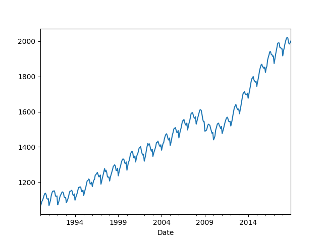
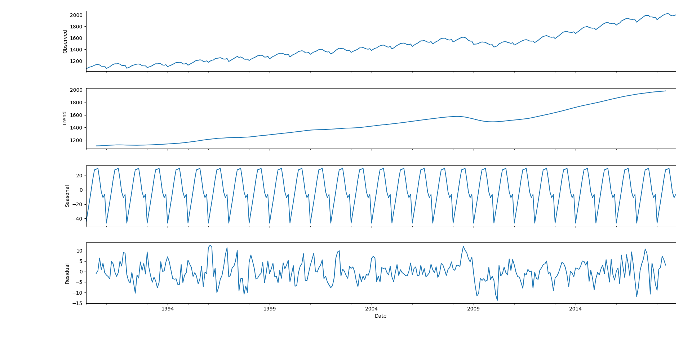
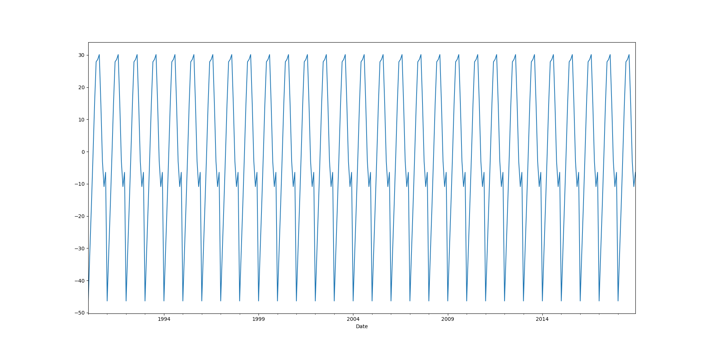
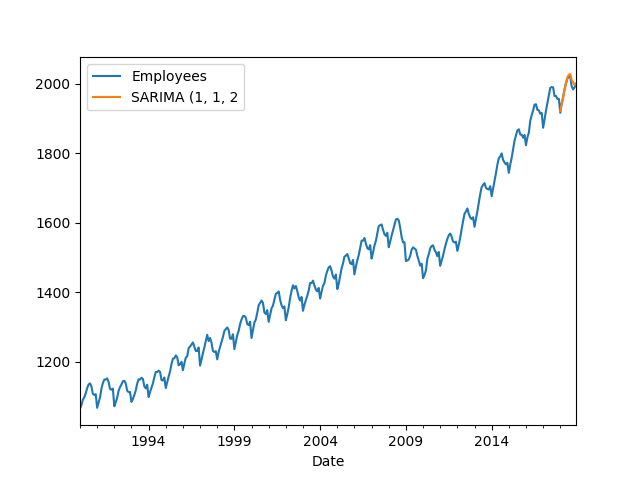
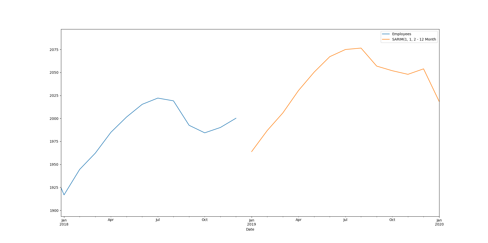

# SARIMAX-TimeSeries
Data of the study is in Data folder.
The distribution of values over time are plotted below

TO make sure if SARIMAX or ARIMA model will be a best FIT, the seasonsal-decompose was plotted

The seasonal part of the plot indicated beyond doubt that the data is values are seasonal in nature and hence SARIMA model will fit best

After test and train split of data, a SARIM model was built using train dataset and tested on test datset.
The prediction vs original data is plotted below

Prediction further ahead in time

